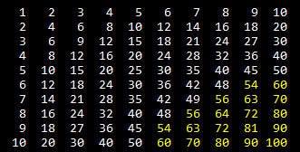

# Flow (for og if)

Ved hjælp af 2 løkker (loop) skal du skabe en 10-tabel på console der ser således ud:

Alle værdier over 50 skal farves eksempelvis gule (brug Console.ForegroundColor). Brug eventuelt PadLeft-metoden fra string-klassen til at højrestille værdien.

Se evt. [løsning for inspiration](https://github.com/devcronberg/undervisning-cs-opgaver/blob/master/Flow-for-if/Program.cs).

<!-- footerstart -->
> Denne opgave må ikke benyttes uden tilladelse fra Michell Cronberg (michell@cronberg.dk)
<!-- footerslut -->
