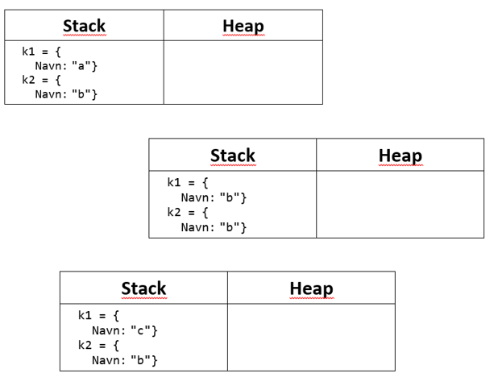
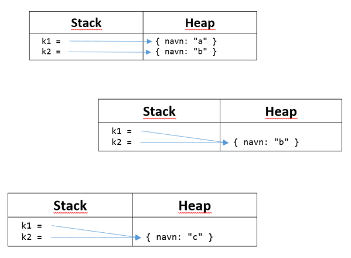

# Hukommelse (struct / class)

Opret en ny konsol app og tilføj en struct kaldet Person med et offentligt string felt kaldet navn:

```csharp
struct Person
{
    public string navn;
}
```

Tilføj kode til main:

1) 
- Opret en ny person med Person k1 = new Person(); (så felter sættes til default værdi – best pratice)
- Opret en ny person med Person k2 = new Person();
- Sæt k1.navn = ”a”
- Sæt k2.navn = ”b”
- Udskriv k1.navn og k2.navn

2) 
- Sæt k1 = k2;
- Udskriv k1.navn og k2.navn

3)
- Sæt k1.navn = ”c”
- Udskriv k1.navn og k2.navn

Hvad skriver den ud – og hvorfor??

Prøv nu at 

- Rette struct Person til class Person

Hvad skriver den ud – og hvorfor??

-------------

Du skulle gerne komme frem til at når der er tale om en værdibaseret variabel (struct) har koden (punkt 1 til punkt 3) følgende konsekvens:



og når der er tale om en class:



Se evt [løsning](https://github.com/devcronberg/undervisning-cs-opgaver/blob/master/Hukommelse-struct-class/Program.cs)

<!-- footerstart -->
> Denne opgave må ikke benyttes uden tilladelse fra Michell Cronberg (michell@cronberg.dk)
<!-- footerslut -->
