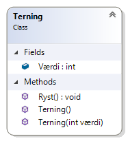

# Klasser (Terning)

Du skal skabe en tom konsol app med en klasse Terning (i en fil for sig selv) med følgende medlemmer:

- En offentlig (public) int værdi
- En metode Ryst() som sætter værdi til en tilfældig værdi mellem 1-6 
	- Se senere
- En default constructor der sætte værdi til 1
- En custom constructor der sætter værdien på terningen til den angivne værdi. Hvis værdien er <1 eller >6 skal der smides en Exception med teksen "Forkert værdi"

For at skabe et tilfældigt tal mellem 1-6 i Ryst-metoden kan du benytte System.Random:

```csharp
System.Random rnd = new System.Random();
int tal = rnd.Next(1,7);
```
Test klassen af i Main ved at skabe instanser og kalde Ryst.

```csharp
Terning t1 = new Terning();
Console.WriteLine(t1.Værdi);    // 1
t1.Ryst();
Console.WriteLine(t1.Værdi);    // tilfældig værdi

Terning t2 = new Terning(2);
Console.WriteLine(t2.Værdi);    // 2
t2.Ryst();
Console.WriteLine(t2.Værdi);    // tilfældig værdi

Terning t3 = new Terning(8);    // Fejl: Forkert værdi
```
## Ekstra

Prøv også at tilføje et klassediagram (class diagram) og se klassen visuelt.



Se evt. løsning - [Terning](https://github.com/devcronberg/undervisning-cs-opgaver/blob/master/Klasser-terning-simpel/Terning.cs) og [Program](https://github.com/devcronberg/undervisning-cs-opgaver/blob/master/Klasser-terning-simpel/Program.cs)

<!-- footerstart -->
> Denne opgave må ikke benyttes uden tilladelse fra Michell Cronberg (michell@cronberg.dk)
<!-- footerslut -->
