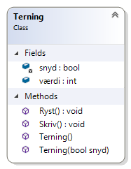

# Klasser (Terning)

Du skal skabe en tom konsol app med en klasse Terning (i en fil for sig selv) med følgende medlemmer:

- En offentlig (public) int værdi
- En privat (private) bool snyd 
- En privat (private) statisk (static) og ny instans af System.Random kaldet rnd 
- En metode Skriv() som udskriver værdien (evt som [2] eller [4])
- En metode Ryst() som sætter værdi til en tilfældig værdi mellem 1-6 rnd.Next(1, 7). Dette skal dog kun ske hvis snyd = false. Hvis snyd = true så skal værdi sættes til 6.
- En default constructor der sætte værdi til 1 og snyd til false
- En custom constructor med en bool argument, der sætter værdi på terningen til en 1 og snyd til den givne værdi fra argumentet

Bemærk - en instans af System.Random kan erklæres således i selve klassen:

```csharp
private static Random rnd = new Random();
```

Det er dog kun nødvendigt i en .NET Framework applikation (der kræves en statisk Random-instans). I en .NET Core applikation kan du blot i metoden der skal bruge et tilfældigt tal skabe en instans af System.Random og bruge den direkte:

```csharp
Random rnd = new Random();
```

Klassen skal altså se således ud:



Test klassen af i Main ved at skabe instanser og kalde Ryst og Skriv. Ret snyd til true/false så du er sikker på at det virker som forventet – eksempelvis:

```csharp
Terning t1 = new Terning();
t1.Skriv();
t1.Ryst();
t1.Skriv();

Terning t2 = new Terning(true);
t2.Skriv();
t2.Ryst();
t2.Skriv();
```

Prøv at oprette et par andre objekter af klassen.

## Ekstra

Prøv også at tilføje et klassediagram (class diagram) og se klassen visuelt.

Se evt. løsning - [Terning](https://github.com/devcronberg/undervisning-cs-opgaver/blob/master/Klasser-terning/Terning.cs) og [Program](https://github.com/devcronberg/undervisning-cs-opgaver/blob/master/Klasser-terning/Program.cs)

<!-- footerstart -->
> Denne opgave må ikke benyttes uden tilladelse fra Michell Cronberg (michell@cronberg.dk)
<!-- footerslut -->
