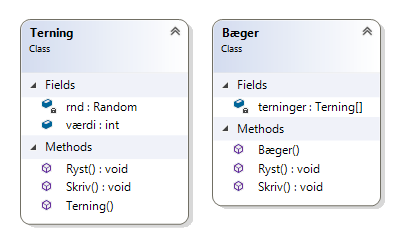

# Bæger med terninger

Opret en ny tom konsol-applikation og definer en terning som (eller skab din egen):

```csharp
public class Terning
{        
	// Kun nødvendig i .NET Framework - ved .NET Core kan man bare benytte en 
	// instans når man har brug for det
	private static System.Random rnd = new Random();
	private int _værdi;
             
    public int Værdi
    {
        get
        {
                
            return this._værdi;
        }

        set
        {
            if (value < 1 || value > 6)
                throw new ApplicationException("Forkert værdi på terning");
                
            this._værdi = value;
        }
    }

        
    public Terning()
    {
        this.Ryst();
    }

    public Terning(int værdi)
    {
        this.Værdi = værdi;
    }


        
    public void Ryst()
    {
        this.Værdi = rnd.Next(1, 7);
    }

    public void Skriv()
    {
        Console.WriteLine(this.ToString());
    }

    public override string ToString()
    {
        return $"[{this.Værdi}]";
    }
}
```
Din opgave er nu at skabe en klasse Bæger som kan indeholde fem terninger i et private 
array af Terning. Klassen skal indeholde følgende medlemmer:

- en constructor der tilføje fem nye terninger til det interne arrays når der skabes en instans af Bæger
- en Ryst-metode der ryster alle terninger i bæger
- en Skriv der udskriver alle terninger som [x] [x] [x] [x] [x] 



Klassen skal kunne bruges som:

```csharp
Bæger b = new Bæger();
b.Skriv();
b.Ryst();
b.Skriv();
```

hvilket kunne udskrive:

```
[4][5][5][2][1]
[4][3][6][5][5]
```

Se evt. [løsning](https://github.com/devcronberg/undervisning-cs-opgaver/blob/master/array-yatzybaeger/Program.cs)

<!-- footerstart -->
> Denne opgave må ikke benyttes uden tilladelse fra Michell Cronberg (michell@cronberg.dk)
<!-- footerslut -->
