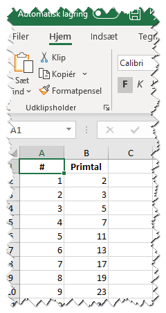

# Gem data i Excel

I denne opgave skal du skabe en samling primtal op til 10.000 og gemmes disse en i Excel-fil (primtal.xlsx) som følger:



Du kan selv skrive en metode til at finde primtal - eller bruge min

```csharp
// Jeg får altså ikke 12 for metode til at finde primtal 
// men den virker. Burde nok bruge yield og iøvrigt se 
// nærmere på https://stackoverflow.com/questions/1042902/most-elegant-way-to-generate-prime-numbers
public static List<int> FindPrimtal(int tilVærdi)
{            
    List<int> listeAfPrimtal = new List<int>();
    bool erPrimtal = true;
    for (int i = 2; i <= tilVærdi; i++)
    {
        for (int j = 2; j <= tilVærdi; j++)
        {
            if (i != j && i % j == 0)
            {
                erPrimtal = false;
                break;
            }
        }
        if (erPrimtal)
        {
            listeAfPrimtal.Add(i);
        }
        erPrimtal = true;
    }            
    return listeAfPrimtal;
}
```

Du kan benytte NuGet-pakken [ClosedXml](https://github.com/ClosedXML/ClosedXML) til at skabe et Excel-ark. Se dokumentation eller brug dette som 
inspiration:

```csharp
using (var workbook = new XLWorkbook())
{
    var ws = workbook.Worksheets.Add("Data");
    ws.Cell(1, 1).Value = "Celle A1";
    ws.Cell(1, 2).Value = "Celle B1";
    workbook.SaveAs(@"c:\temp\primtal.xlsx");
}
```
Se min løsning [her](https://github.com/devcronberg/undervisning-cs-opgaver/blob/master/data-excel/Program.cs).

<!-- footerstart -->
> Denne opgave må ikke benyttes uden tilladelse fra Michell Cronberg (michell@cronberg.dk)
<!-- footerslut -->
