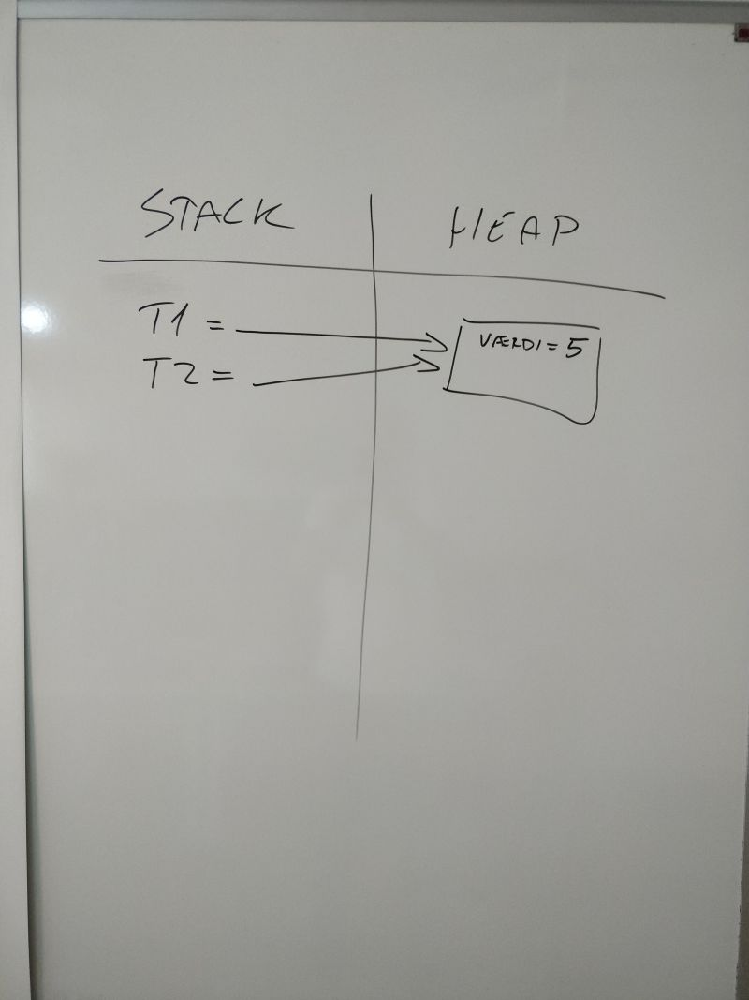
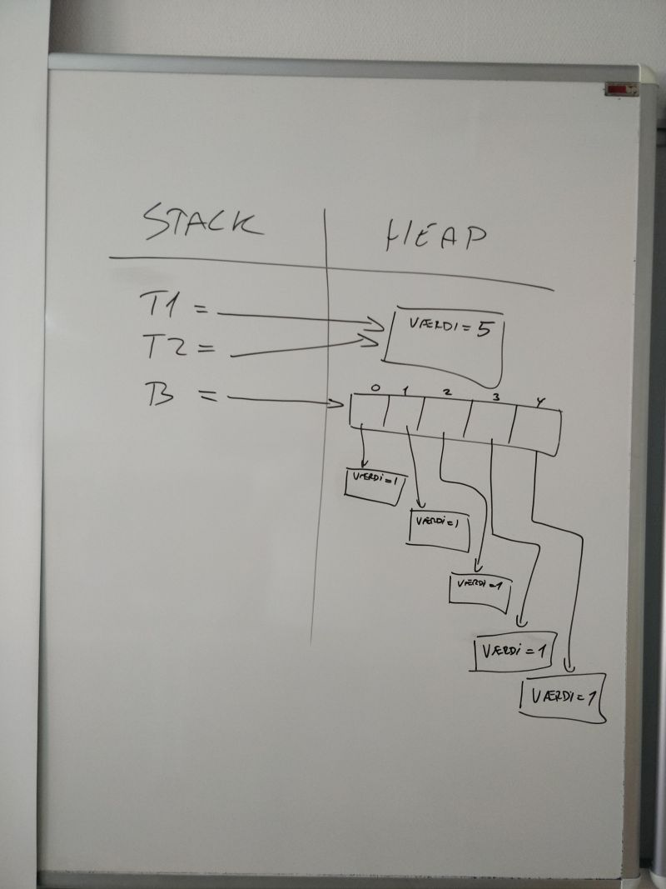
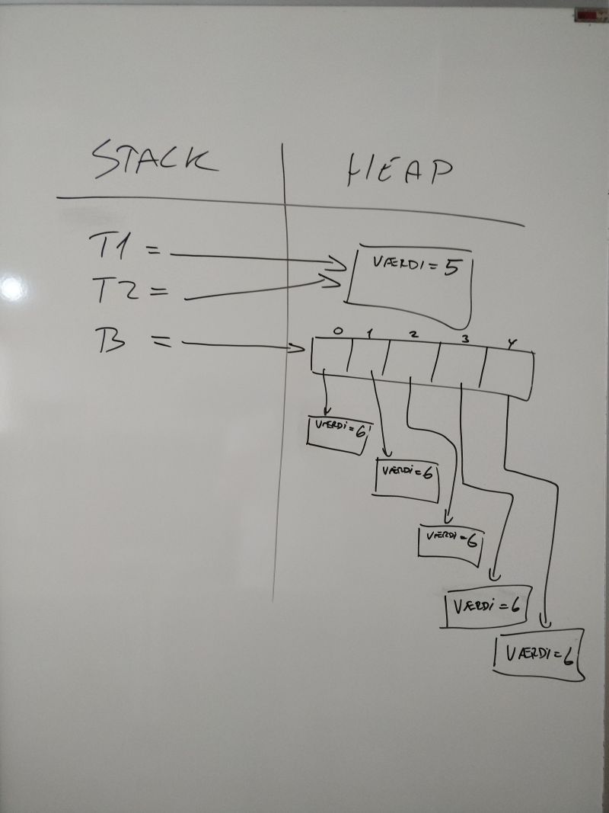

# Hukommelse (terning og bæger)

Denne opgave er lidt speciel for du skal ikke skrive noget kode men tegne et 
stack/heap diagram ud fra eksisterende kode. Start med at skabe en tom 
.NET konsol applikation, og erstat eksisterende kode med følgende:

```csharp
using System;

namespace hukommelse_visualiser
{
    class Program
    {
        static void Main(string[] args)
        {

            // Spørgsmål 1 
            Terning t1 = new Terning(3);
            t1.Skriv();
            Console.WriteLine();

            // Spørgsmål 2 
            Terning t2 = t1;
            t2.Skriv();
            Console.WriteLine();

            // Spørgsmål 3
            t1.værdi = 5;
            t1.Skriv();
            Console.WriteLine();
            t2.Skriv();
            Console.WriteLine();

            Console.WriteLine();
            
            // Spørgsmål 4
            Bæger b = new Bæger();
            b.Skriv();

            // Spørgsmål 5
            b.SætVærdiPåAlleTerninger(6);
            b.Skriv();

        }
    }

    public class Terning
    {
        // Ved .NET Core behøver den ikke være statisk!!
        private static Random rnd = new Random();
        public int værdi;

        public Terning()
        {
            this.værdi = 1;
        }

        public Terning(int værdi)
        {
            if (værdi < 1 || værdi > 6)
                throw new ApplicationException("Forkert værdi");
            this.værdi = værdi;
        }

        public void Skriv()
        {
            Console.Write("[" + this.værdi + "]");
        }

        public void Ryst()
        {
            this.værdi = rnd.Next(1, 7);
        }
    }

    public class Bæger
    {
        private Terning[] terninger = new Terning[5];

        public Bæger()
        {
            for (int i = 0; i < 5; i++)
                terninger[i] = new Terning();
        }

        public void Ryst()
        {
            for (int i = 0; i < 5; i++)
                terninger[i].Ryst();
        }

        public void SætVærdiPåAlleTerninger(int værdi)
        {
            for (int i = 0; i < 5; i++)
                terninger[i].værdi = værdi;
        }

        public void Skriv()
        {
            for (int i = 0; i < 5; i++)
                terninger[i].Skriv();
            Console.WriteLine();
        }
    }
}
```

Kør applikationen og bekræft at den udskriver

```
[3]
[3]
[5]
[5]

[1][1][1][1][1]
[6][6][6][6][6]
```

Din opgave er nu at finde de fem spørgsmål i main og tegne på et stykke papir hvad 
den efterfølgende kode betyder på stack og heap.

## Løsning
Du skulle gerne nå frem til noget ala:

### Spørgsmål 1


### Spørgsmål 2


### Spørgsmål 3


### Spørgsmål 4


### Spørgsmål 5


<!-- footerstart -->
> Denne opgave må ikke benyttes uden tilladelse fra Michell Cronberg (michell@cronberg.dk)
<!-- footerslut -->
