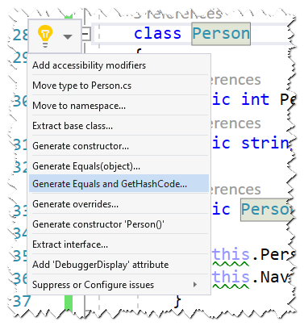
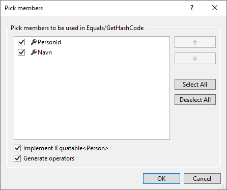

# En uforanderlig (immutable) klasse 

I denne opgave skal du designe en immutable (uforanderlig) klasse Person med to egenskaber

- PersonId (int)
- Navn (string)

Til at starte med skal du designe klassen således, at egenskaberne udelukkende skal kunne 
tildeles en værdi gennem en brugerdefineret konstruktør (ingen konstruktør uden argumenter - man skal benytte den
brugerdefinerede konstruktør). 

Når først et objekt er skabt må data ikke kunne ændres.

Klassen skal også bestå af en overskrivning af ToString således, at den returnerer eksempelvis

```csharp
Console.WriteLine(o);	// Person { PersonId: 1, Navn: Mikkel } 
```

Med klassen skal du kunne benytte følgende kode

```csharp
Person p1 = new Person(1, "Mikkel");
Console.WriteLine(p1.Navn);	// Mikkel
// p1.Navn = "Mathias";     // Fejl
Console.WriteLine(p1);      // Person { PersonId: 1, Navn: Mikkel }

// Hvis du ønsker en kopi med ændrede data må du
Person p2 = new Person(2, p1.Navn);
Console.WriteLine(p2);      // Person { PersonId: 2, Navn: Mikkel }
```

Prøv at skabe to objekter med samme data og sammenlign:

```csharp
Person p3 = new Person(1, "Mathias");
Person p4 = new Person(1, "Mathias");
Console.WriteLine(p3 == p4);// false
```

Sammenligning returnerer true fordi variablerne ikke indeholder samme reference - men det skal du ændre på nu ved at 
overskrive metoderne Equals og GetHashCode samt operatorerne == og !=. Du behøver ikke skrive koden selv med lade VS gøre dette
ved at vælge "Override "



Sørg for at alle egenskaber er valgt, der implementeres IEquatable og overskrives operatorer



Prøv nu at køre følgende kode igen

```csharp
Person p3 = new Person(1, "Mathias");
Person p4 = new Person(1, "Mathias");
Console.WriteLine(p3 == p4);// true
```

Nu returnerer sammenligning true fordi der sammenlignes på værdier. Prøv eventuelt også

```csharp
Console.WriteLine(ReferenceEquals(p3, p4)); // false
```

Her sammenlignes på referencer og derfor returneres false.

## Ekstra - brug af C# 9 records

Ovennævnte kode Person-klasse kan erstattes fuldstændig af en record (C# 9). Prøv selv ved at udmarkere klassen og tilføje:

```csharp
record Person(int PersonId, string Navn);
```

