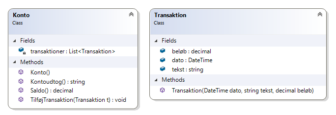

# Klasser (Konto/Transaktion)

Du skal skabe en tom konsol app med klasser der skal bruges i en bank applikation.

## Transaktion

Klassen Transaktion repræsenterer en enkelt transaktion med følgende felter:

- dato (DateTime)
- tekst (string)
- beløb (decimal)

Felterne skal blot være offentlige - **se bort fra indkapsling og sikkerhed i denne opgave**.

Klassen Konto med følgende felt

transaktioner (List\<Transaktion\>)

Igen - listen skal blot være offentligt - **se bort fra indkapsling og sikkerhed i denne opgave**.

Klassen skal også bestå af en metode Saldo, som returnerer summen af alle transaktioner.



Du kan bruge følgende kode til at teste klasserne:

```csharp
Konto k = new Konto();
k.transaktioner.Add(new Transaktion(new DateTime(2019, 1, 1), "Indsat", 100));
k.transaktioner.Add(new Transaktion(new DateTime(2019, 2, 1), "Indsat", 250));
k.transaktioner.Add(new Transaktion(new DateTime(2019, 3, 1), "Hævet", -75));
Console.WriteLine($"Saldo: {k.Saldo():N2}");
```

Husk, at i denne opgave må du gerne benytte offentlige felter - men tænk over konsekvensen... Kode som følgende er ikke så godt:

```csharp
Konto k = new Konto();
k.transaktioner.Add(new Transaktion(new DateTime(2019, 1, 1), "Indsat", 100));
k.transaktioner.Add(new Transaktion(new DateTime(2019, 2, 1), "Indsat", 250));
k.transaktioner.Add(new Transaktion(new DateTime(2019, 3, 1), "Hævet", -75));
Console.WriteLine($"Saldo: {k.Saldo():N2}");
k.transaktioner[0].beløb = 1000;
Console.WriteLine($"Saldo: {k.Saldo():N2}");
```

***Du behøver ikke ændre koden for at sikre den bedre, men det er vigtigt at du kan se problemet. Alle der kan skabe en konto,
og tilføje transaktioner kan også efterfølgende tilrette eksisterende transaktioner.***

## Ekstra

Skab en metode KontoUdtog() som returnerer en streng der minder om et kontoudtog (PS - husk at bruge StringBuilder til at skabe strenge i løkker!!!). Resultatet kunne se således ud:

```
01-01-2019 Indsat                   100,00
01-02-2019 Indsat                   250,00
01-03-2019 Hævet                    -75,00
```
Se evt [løsning](https://github.com/devcronberg/undervisning-cs-opgaver/blob/master/klasser-amort/Program.cs)
<!-- footerstart -->
> Denne opgave må ikke benyttes uden tilladelse fra Michell Cronberg (michell@cronberg.dk)
<!-- footerslut -->